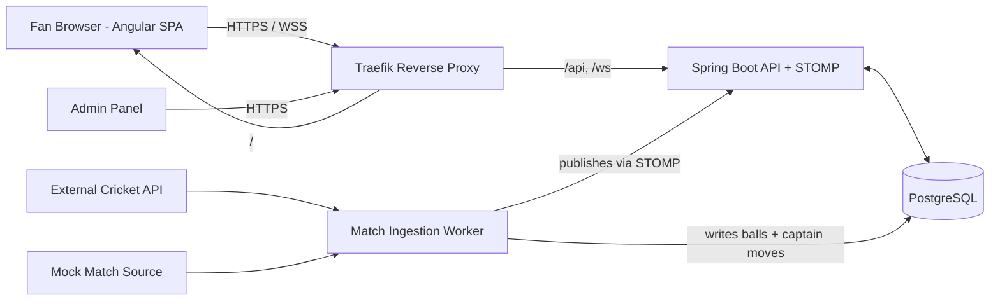
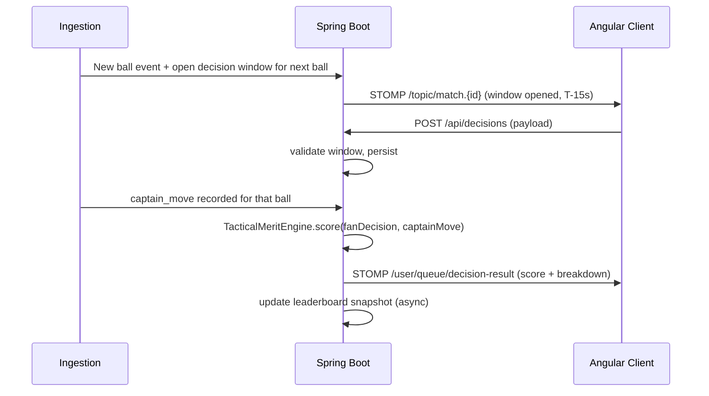

## 1. High-Level Architecture



Single Spring Boot service exposes REST + STOMP-over-WebSocket. A scheduled component inside the same JAR polls a pluggable `MatchDataProvider`, persists events, and publishes to STOMP topics.

**Why STOMP over WebSocket (vs SSE):** bidirectional, per-user destinations (`/user/queue/decision-result`), idiomatic in Spring (`spring-boot-starter-websocket`), and lets us swap the in-memory simple broker for a RabbitMQ STOMP relay later without changing client code when we need to scale beyond one node.

## 2. Modules and Key Files (proposed)

Backend (`backend/src/main/java/com/coachsim/`):

- `auth/` — `AuthController`, `JwtService`, `SecurityConfig` (Spring Security + JWT, BCrypt)
- `user/` — `User` entity, `UserRepository`, `ProfileController`
- `match/` — `Match`, `Innings`, `Ball`, `CaptainMove` entities + repos; `MatchController` (list/details)
- `ingestion/`
  - `MatchDataProvider` interface — `Flux<MatchEvent> stream(matchId)` or pull-based `List<MatchEvent> pollSince(...)`
  - `MockMatchDataProvider` (reads scripted timeline from DB, admin-triggered)
  - `ExternalCricketApiProvider` (HTTP polling, mapped to internal model)
  - `IngestionScheduler` (`@Scheduled`) picks impl via `app.ingestion.provider` property
- `decision/` — `FanDecision` entity, `DecisionWindow` (opens before each ball/over for N seconds), `DecisionController` (`POST /api/decisions`), `DecisionService` (validates window, persists, enqueues scoring)
- `scoring/` — `TacticalMeritEngine` (rules v1, see §4), `ScoreCalculatorService`, designed behind a `ScoringStrategy` interface so an ML service can slot in later
- `leaderboard/` — `LeaderboardService` (per-match, per-season, all-time), materialized via scheduled refresh of a `leaderboard_snapshot` table to avoid heavy aggregations on each request
- `realtime/` — `WebSocketConfig` (STOMP, `/ws` endpoint, `/topic/match.{id}` and `/user/queue/...`), `MatchEventPublisher`
- `admin/` — `AdminController` for creating mock matches, advancing balls, setting captain's move (gated by `ROLE_ADMIN`)

Frontend (`frontend/src/app/`):

- `core/` — `AuthService`, `AuthInterceptor`, `WebSocketService` (uses `@stomp/rx-stomp`)
- `features/auth/` — login, register
- `features/match-live/` — `LiveMatchComponent` (score, current ball), `DecisionPanelComponent` (field placement grid + bowling change dropdown, countdown timer), `RevealComponent` (your move vs captain's + score)
- `features/leaderboard/`
- `features/profile/` — decision history, tactical-merit trend
- `features/admin/` — match control panel (only shown for admin role)

## 3. Data Model (core tables)

- `users(id, email, password_hash, display_name, role, created_at)`
- `matches(id, external_id, season, home_team, away_team, venue, status, source)`
- `innings(id, match_id, batting_team, bowling_team, number)`
- `balls(id, innings_id, over, ball_in_over, bowler_id, batter_id, runs, wicket, extras, created_at)`
- `captain_moves(id, match_id, type [BOWLING_CHANGE|FIELD_SET], before_over, before_ball, payload_json, created_at)`
- `decision_windows(id, match_id, opens_at, closes_at, target_type, target_ref)`
- `fan_decisions(id, user_id, window_id, payload_json, submitted_at)`
- `decision_scores(id, fan_decision_id, captain_move_id, merit_score, breakdown_json, computed_at)`
- `leaderboard_snapshot(scope [MATCH|SEASON|ALLTIME], scope_ref, user_id, total_score, rank, refreshed_at)`

JPA L2 cache (ehcache local) enabled on read-mostly reference tables: `users`, `matches`, `captain_moves`.

## 4. Tactical-Merit Scoring (Rules v1)

Each fan decision scored 0–100 along weighted dimensions, breakdown stored in `breakdown_json` for explainability:

- **Exact match with captain** (+50)
- **Historical economy/strike-rate fit**: lookup aggregate from `balls` table for `(bowler_type, batter_hand, over_phase)` — if fan's chosen bowler type has better historical economy in this phase than captain's, partial credit (+0–30)
- **Field placement coverage**: for chosen field, compute % of batter's historical wagon-wheel zones covered (+0–20)
- **Penalty** for illegal configs (e.g., >5 fielders on leg side outside circle) — reject at submit time

Rules live in `scoring/rules/` as small Java classes implementing `Rule { Score apply(Context ctx) }`, summed by `TacticalMeritEngine`. Easy to unit test and to swap with `MlScoringStrategy` later.

## 5. Real-Time Decision Flow



## 6. Deployment Strategy

All Docker and deployment configuration is consolidated under a single top-level `devops/` folder. Application `Dockerfile`s stay co-located with their source (`backend/Dockerfile`, `frontend/Dockerfile`) so the build context stays minimal — compose files in `devops/` reference them via `build.context: ../backend` etc.

Compose files (base + overlays):

- `devops/docker-compose.yml` (base): `postgres`, `backend`, `frontend`, `traefik`
- `devops/docker-compose.dev.yml`: hot-reload via Spring DevTools + `ng serve` proxied through Traefik; Traefik dashboard exposed; provider=`mock`
- `devops/docker-compose.prod.yml`: built JAR + nginx-served Angular bundle; Traefik with Let's Encrypt (`certificatesresolvers.le.acme`); provider=`external`; restart policies; healthchecks; resource limits

Run commands (from repo root):

```bash
docker compose -f devops/docker-compose.yml -f devops/docker-compose.dev.yml --env-file devops/.env.dev up
docker compose -f devops/docker-compose.yml -f devops/docker-compose.prod.yml --env-file devops/.env.prod up -d
```

Traefik routing (labels on services in compose files, dynamic TLS in `devops/traefik/dynamic/`):

- `Host(\`coachsim.example.com\`) && PathPrefix(\`/api\`)` → backend
- `Host(\`coachsim.example.com\`) && PathPrefix(\`/ws\`)`→ backend (sticky session via`loadbalancer.sticky.cookie`)
- `Host(\`coachsim.example.com\`)` → frontend (catch-all)

Operational concerns:

- **Migrations**: Flyway in backend (`db/migration/V1__init.sql`, etc.) — runs on startup.
- **Config**: Spring profiles `dev` / `prod`; secrets (DB pwd, JWT signing key, external API key) injected via env files (`devops/.env.dev`, `devops/.env.prod`, gitignored) with `.example` templates checked in.
- **Observability**: Spring Boot Actuator + Micrometer Prometheus endpoint; logs to stdout (JSON via Logback) for Docker log driver.
- **Healthchecks**: `/actuator/health` for backend, `pg_isready` for db, Traefik `ping` for itself.
- **Backups**: nightly `pg_dump` sidecar (`devops/backups/pg-dump.sh`) writing to a mounted volume.
- **Helper scripts**: `devops/scripts/up-dev.{sh,ps1}`, `up-prod.{sh,ps1}`, `deploy.sh` wrap the long `docker compose` invocations.
- **Horizontal scale path**: bump backend replicas in compose; switch STOMP simple-broker to RabbitMQ STOMP relay (already abstracted in `WebSocketConfig`); Traefik sticky cookie handles WS affinity.

## 7. Repository Layout

```
/
├─ backend/                          Spring Boot (Java 21, Gradle)
│  ├─ src/main/java/com/coachsim/...
│  ├─ src/main/resources/db/migration/
│  └─ Dockerfile                     (kept next to source for clean build context)
├─ frontend/                         Angular 17+ (standalone components)
│  ├─ src/app/...
│  └─ Dockerfile                     (multi-stage build -> nginx)
├─ devops/                           ALL docker + deployment config lives here
│  ├─ docker-compose.yml             base stack
│  ├─ docker-compose.dev.yml         dev overlay (hot reload, mock provider, dashboard)
│  ├─ docker-compose.prod.yml        prod overlay (Let's Encrypt, healthchecks, limits)
│  ├─ .env.dev.example               template for dev env vars
│  ├─ .env.prod.example              template for prod env vars
│  ├─ traefik/
│  │  ├─ traefik.yml                 static config (entrypoints, providers, ACME)
│  │  └─ dynamic/
│  │     └─ tls.yml                  TLS options + middlewares (headers, rate limit)
│  ├─ postgres/
│  │  └─ init.sql                    optional bootstrap (roles, extensions)
│  ├─ backups/
│  │  └─ pg-dump.sh                  nightly pg_dump sidecar script
│  └─ scripts/
│     ├─ up-dev.sh / up-dev.ps1      wrap `docker compose -f ... up`
│     ├─ up-prod.sh / up-prod.ps1
│     └─ deploy.sh                   pull, migrate, rollout, smoke-check
└─ README.md
```

## 8. Out of Scope for v1 (called out so we don't bloat MVP)

- ML-based scoring (interface ready, impl later)
- Push notifications / mobile apps
- Payment / cash rewards (leaderboard + badges only)
- Multi-region HA, Kubernetes
